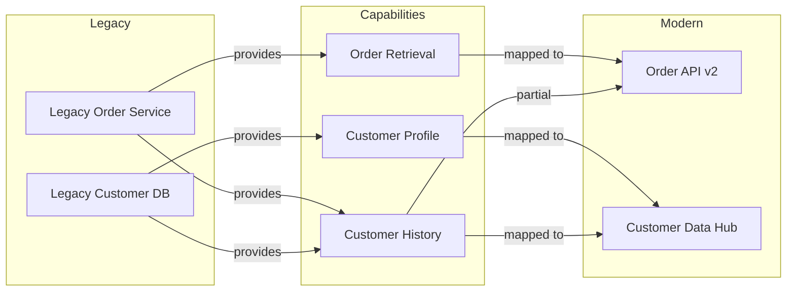

# Platform Migration Analysis Tool - Research Document

## Executive Summary

This research explores building a platform migration analysis tool to help companies modernizing from legacy to modern tech stacks. The tool will analyze both architectures and provide functionality mapping between systems (e.g., "System A provides order details in legacy → which system in new platform?").

Research completed: 2025-11-16

---

## 1. Core Principles Applied (from CLAUDE.md & GlobalRules)

### Architectural Principles

**TYPE SAFETY IS NON-NEGOTIABLE**
- All analysis outputs, mappings, and configurations must be strongly typed
- Use Pydantic models for architecture definitions, system mappings, and capability models
- Strict mypy enforcement for all analysis logic

**KISS (Keep It Simple, Stupid)**
- Start with basic system-to-system mapping before complex dependency graphs
- Avoid over-engineering the analysis engine
- Simple, readable configuration formats (YAML/JSON with schema validation)

**YAGNI (You Aren't Gonna Need It)**
- Build core mapping functionality first
- Don't implement predictive migration recommendations until proven necessary
- Defer advanced features like automated code migration or AI-powered suggestions

**Vertical Slice Architecture**
- Each analysis capability as independent slice (dependency_analyzer/, capability_mapper/, architecture_comparator/)
- Tools structure: tool.py, schemas.py, service.py per capability
- Shared components: config, logging, visualization

**AI-Optimized Structured Logging**
- Log all analysis decisions with context for AI debugging
- Use descriptive event names: `system_mapping_created`, `capability_match_found`, `dependency_conflict_detected`
- Include correlation IDs to trace analysis flows across components

---

## 2. Problem Statement

### Current State

Companies undergoing platform modernization face:
- **Unclear system mapping**: Which modern system replaces legacy System A's capabilities?
- **Lost functionality**: Risk of missing capabilities during migration
- **Knowledge silos**: Tribal knowledge about "who provides what" scattered across teams
- **Manual tracking**: Spreadsheets and documentation that become stale
- **Impact blindness**: Changes to one system affect unknown downstream consumers

### User Story

> As a **Platform Migration Architect**, I want to **query which modern platform system provides the same functionality as a legacy system**, so that **I can ensure feature parity and plan migration dependencies without losing capabilities**.

Example query:
- Legacy: "System A provides order details"
- Tool answers: "In modern platform, OrderService API (v2) and CustomerDataHub both provide order details. OrderService provides real-time orders, CustomerDataHub provides historical."

---

## 3. Research Findings

### 3.1 Existing Tool Categories

#### Application Dependency Mapping (ADM) Tools

**Key Tools:**
- **Faddom**: AI-driven correlation, real-time dependency mapping without code changes
- **Device42**: Legacy system identification and connection mapping
- **CodeLogic**: AI-powered dependency mapping and legacy code analysis
- **Datadog**: Service relationship visualization using live telemetry

**Capabilities:**
- Auto-detect relationships between apps, databases, servers, services
- Network traffic analysis + agent-based monitoring
- Impact analysis for changes and modernization

**Gap for our use case:**
- Focus on infrastructure dependencies, NOT functional capability mapping
- Limited semantic understanding of "what functionality does this system provide?"
- No concept of capability equivalence across platforms

#### Data Lineage Tools

**Key Tools:**
- **Acceldata**: Continuous data flow mapping with AI issue detection
- **Apache Atlas**: Metadata management with Hadoop ecosystem integration
- **Manta**: Automated lineage extraction from ETL, SQL, procedures; column-level granularity

**Capabilities:**
- Track data flow from source → destination across transformations
- Column-level lineage for granular impact analysis
- Automated integration with 150+ data sources (OvalEdge)
- Change impact analysis

**Gap for our use case:**
- Focus on data flow, NOT business capability mapping
- No semantic layer for "order details capability" across systems
- Designed for data governance, not platform migration planning

#### Knowledge Graph Approaches

**Research Findings:**
- Layered architecture: Data Storage → Service Layer → Application Layer
- Semantic modeling enables entity-relationship mapping across domains
- Enterprise implementations use polymorphic stores (IBM Watson KG)
- Integration with data fabric for unified contextual view

**Relevant for our use case:**
- Knowledge graphs can model "Capability" as nodes with relationships to "Systems"
- Semantic queries like "Which systems provide OrderDetail capability?"
- Can capture migration mappings: `Legacy.SystemA --provides--> Capability.OrderDetails <--provides-- Modern.OrderServiceAPI`

---

### 3.2 Migration Approaches

**Industry Standard Migration Types:**
1. **Rehosting** (Lift & Shift): Move as-is to new infrastructure
2. **Replatforming** (Lift & Reshape): Minor optimizations during move
3. **Refactoring** (Re-architect): Redesign for cloud-native patterns
4. **Repurchasing**: Replace with SaaS/COTS products
5. **Retiring**: Decommission obsolete systems
6. **Replacing**: Build new systems from scratch

**Implication for tool:**
- Different migration types require different analysis granularity
- Retiring systems need dependency analysis to ensure no orphaned consumers
- Refactoring needs capability-level mapping (our focus)
- Repurchasing needs feature comparison (legacy vs. new product capabilities)

---

## 4. Proposed Solution Architecture

### 4.1 System Capability Model (Core Abstraction)

```python
from pydantic import BaseModel, Field
from typing import Literal

class Capability(BaseModel):
    """Represents a business capability (e.g., 'Provide Order Details')."""
    id: str  # e.g., "order_details"
    name: str  # e.g., "Order Details Retrieval"
    description: str
    domain: str  # e.g., "Orders", "Customer", "Inventory"
    data_entities: list[str]  # e.g., ["Order", "OrderLineItem", "Customer"]

class System(BaseModel):
    """Represents a system in either legacy or modern platform."""
    id: str
    name: str
    platform: Literal["legacy", "modern"]
    tech_stack: list[str]  # e.g., ["Java 8", "Oracle 11g", "WebLogic"]
    capabilities: list[str]  # List of Capability IDs this system provides

class CapabilityMapping(BaseModel):
    """Maps a capability from legacy → modern system(s)."""
    capability_id: str
    legacy_systems: list[str]  # System IDs
    modern_systems: list[str]  # System IDs
    mapping_type: Literal["one_to_one", "one_to_many", "many_to_one", "partial", "missing"]
    confidence: float = Field(ge=0.0, le=1.0)  # 0.0 = manual mapping, 1.0 = verified
    notes: str = ""
```

**Rationale (KISS + Type Safety):**
- Simple domain model focused on capabilities, not code-level dependencies
- Pydantic ensures all mappings are validated
- Clear separation: Capability (what) vs. System (where)

### 4.2 Vertical Slice Architecture

```
src/
├── agent/                  # Orchestration (future: AI agent for querying)
├── core/
│   ├── models/            # Pydantic models (Capability, System, Mapping)
│   ├── schemas/           # API request/response schemas
├── tools/
│   ├── capability_mapper/ # Tool: Map capabilities between platforms
│   │   ├── tool.py        # Pydantic AI tool definition
│   │   ├── schemas.py     # Tool-specific schemas
│   │   ├── service.py     # Business logic for mapping
│   ├── system_analyzer/   # Tool: Analyze system architecture
│   │   ├── tool.py
│   │   ├── schemas.py
│   │   ├── service.py
│   ├── dependency_tracer/ # Tool: Trace capability dependencies
│   │   ├── tool.py
│   │   ├── schemas.py
│   │   ├── service.py
├── shared/
│   ├── config.py          # Configuration (platform definitions)
│   ├── logging.py         # Structured logging
│   ├── visualization.py   # Generate capability maps (Graphviz/Mermaid)
└── storage/
    ├── graph_store.py     # Knowledge graph backend (Neo4j/NetworkX)
    ├── config_store.py    # YAML/JSON configuration loader
```

**Rationale:**
- Follows Obsidian Agent vertical slice pattern from CLAUDE.md
- Each tool is independent and testable
- Shared components avoid duplication
- Storage layer abstracted for future scalability (start with JSON/YAML, migrate to graph DB if needed - YAGNI)

### 4.3 Core Tools (Pydantic AI Agent Tools)

#### Tool 1: System Architecture Analyzer

```python
def analyze_system_architecture(
    system_id: str,
    platform: Literal["legacy", "modern"]
) -> SystemAnalysisResult:
    """Analyze a system's architecture and identify capabilities.

    Use this when:
    - Loading a new system into the migration analysis
    - Updating system metadata after architecture changes
    - Auditing what capabilities a system currently provides

    Do NOT use:
    - For comparing systems (use capability_mapper instead)
    - For dependency tracing (use dependency_tracer instead)

    Args:
        system_id: Unique identifier for the system
        platform: Whether this is a "legacy" or "modern" system

    Returns:
        SystemAnalysisResult with identified capabilities, tech stack, dependencies

    Performance Notes:
        - Execution: 100-500ms for config-based analysis
        - Token cost: ~50 tokens for result serialization

    Example:
        analyze_system_architecture(
            system_id="legacy_order_service",
            platform="legacy"
        )
        # Returns: SystemAnalysisResult(
        #   capabilities=["order_retrieval", "order_history"],
        #   tech_stack=["Java 8", "Oracle 11g"],
        #   ...
        # )
    """
```

#### Tool 2: Capability Mapper

```python
def find_capability_provider(
    capability_id: str,
    platform: Literal["legacy", "modern"]
) -> list[System]:
    """Find which systems provide a specific capability.

    Use this when:
    - User asks "which system provides X in modern platform?"
    - Planning migration and need to identify modern replacement
    - Verifying capability coverage across platforms

    Do NOT use:
    - For listing all capabilities (use list_capabilities instead)
    - For comparing capability implementations (use compare_capability_implementations)

    Args:
        capability_id: The capability to search for (e.g., "order_details")
        platform: Which platform to search ("legacy" or "modern")

    Returns:
        List of System objects that provide this capability

    Performance Notes:
        - Execution: 10-50ms (in-memory lookup)
        - Token cost: ~20 tokens per system returned

    Example:
        find_capability_provider(
            capability_id="order_details",
            platform="modern"
        )
        # Returns: [
        #   System(name="OrderServiceAPI", ...),
        #   System(name="CustomerDataHub", ...)
        # ]
    """
```

#### Tool 3: Migration Impact Analyzer

```python
def analyze_migration_impact(
    legacy_system_id: str
) -> MigrationImpactReport:
    """Analyze impact of migrating/retiring a legacy system.

    Use this when:
    - Planning to retire a legacy system
    - Assessing migration risk for a system
    - Identifying downstream consumers that need updates

    Do NOT use:
    - For general capability queries (use find_capability_provider)
    - For architecture analysis (use analyze_system_architecture)

    Args:
        legacy_system_id: The legacy system being migrated/retired

    Returns:
        MigrationImpactReport with:
        - Capabilities that will be lost if not mapped
        - Modern systems that provide equivalent capabilities
        - Confidence scores for each mapping
        - Downstream consumers affected

    Performance Notes:
        - Execution: 200-1000ms (depends on dependency depth)
        - Token cost: ~200-500 tokens for comprehensive report

    Example:
        analyze_migration_impact(
            legacy_system_id="legacy_order_service"
        )
        # Returns: MigrationImpactReport(
        #   capabilities_at_risk=["order_retrieval"],
        #   modern_replacements=[...],
        #   consumers_affected=[...],
        #   ...
        # )
    """
```

### 4.4 Configuration-Driven Approach (KISS)

**Platform Definition (YAML)**

```yaml
# config/platforms/legacy.yaml
platform: legacy
systems:
  - id: legacy_order_service
    name: Legacy Order Service
    tech_stack:
      - Java 8
      - Oracle 11g
      - SOAP/XML
    capabilities:
      - order_retrieval
      - order_history
      - order_validation
    endpoints:
      - name: GetOrderDetails
        protocol: SOAP
        returns: OrderDTO

  - id: legacy_customer_db
    name: Legacy Customer Database
    tech_stack:
      - Oracle 11g
      - PL/SQL
    capabilities:
      - customer_profile
      - customer_history

# config/platforms/modern.yaml
platform: modern
systems:
  - id: modern_order_api
    name: Order Service API v2
    tech_stack:
      - Java 17
      - PostgreSQL
      - REST/JSON
      - Kubernetes
    capabilities:
      - order_retrieval      # Maps to legacy
      - order_history        # Maps to legacy
      - real_time_tracking   # NEW capability
    endpoints:
      - name: GET /orders/{id}
        protocol: REST
        returns: OrderResponse

  - id: modern_customer_data_hub
    name: Customer Data Hub
    tech_stack:
      - Python 3.11
      - Snowflake
      - GraphQL
    capabilities:
      - customer_profile     # Maps to legacy
      - customer_360_view    # NEW capability
      - customer_history     # Maps to legacy (historical only)

# config/capabilities.yaml
capabilities:
  - id: order_retrieval
    name: Order Details Retrieval
    description: Retrieve current order information by order ID
    domain: Orders
    data_entities:
      - Order
      - OrderLineItem
      - ProductSKU

  - id: customer_profile
    name: Customer Profile
    description: Retrieve customer demographic and contact information
    domain: Customer
    data_entities:
      - Customer
      - ContactInfo
      - Address

# config/mappings.yaml
mappings:
  - capability_id: order_retrieval
    legacy_systems:
      - legacy_order_service
    modern_systems:
      - modern_order_api
    mapping_type: one_to_one
    confidence: 1.0
    notes: "Verified: Modern API provides superset of legacy functionality"

  - capability_id: customer_history
    legacy_systems:
      - legacy_customer_db
    modern_systems:
      - modern_customer_data_hub
      - modern_order_api  # Also stores order history
    mapping_type: one_to_many
    confidence: 0.8
    notes: "Partial: Customer Data Hub has historical data, Order API has recent orders only"
```

**Rationale (KISS + YAGNI):**
- Start with human-authored YAML configs (simple, version-controllable)
- No automated discovery phase initially (YAGNI - add later if needed)
- Schema validation via Pydantic ensures correctness
- Easy to understand and modify without code changes

### 4.5 Storage Strategy

**Phase 1 (MVP): JSON/YAML Files + In-Memory Graph**

```python
# storage/config_store.py
from pathlib import Path
import yaml
from typing import Dict, List
from core.models import System, Capability, CapabilityMapping

class ConfigStore:
    """Load platform configurations from YAML files."""

    def __init__(self, config_dir: Path):
        self.config_dir = config_dir
        self._systems: Dict[str, System] = {}
        self._capabilities: Dict[str, Capability] = {}
        self._mappings: List[CapabilityMapping] = []

    def load_all(self) -> None:
        """Load all configurations with structured logging."""
        logger.info("config_load_started", config_dir=str(self.config_dir))

        # Load capabilities
        caps_file = self.config_dir / "capabilities.yaml"
        with open(caps_file) as f:
            data = yaml.safe_load(f)
            for cap_data in data["capabilities"]:
                cap = Capability(**cap_data)
                self._capabilities[cap.id] = cap

        logger.info("capabilities_loaded", count=len(self._capabilities))

        # Load platforms (legacy, modern)
        # ... similar pattern

        logger.info("config_load_completed",
                   systems=len(self._systems),
                   capabilities=len(self._capabilities),
                   mappings=len(self._mappings))
```

**Phase 2 (Future): Knowledge Graph (Neo4j/NetworkX)**

- Only if query complexity demands graph algorithms (shortest path, centrality)
- Neo4j Cypher queries for complex capability traversals
- YAGNI: Don't implement until file-based approach proves insufficient

---

## 5. Key Capabilities

### 5.1 Core Query Types

**Q1: Capability Provider Lookup**
- User query: "Which system provides order details in modern platform?"
- Tool flow: `find_capability_provider(capability_id="order_details", platform="modern")`
- Output: List of modern systems with confidence scores and notes

**Q2: Migration Impact Analysis**
- User query: "What happens if we retire legacy_order_service?"
- Tool flow: `analyze_migration_impact(legacy_system_id="legacy_order_service")`
- Output: Report showing:
  - Capabilities at risk
  - Modern replacements
  - Downstream consumers affected
  - Recommended migration sequence

**Q3: Capability Gap Analysis**
- User query: "Are there any legacy capabilities not covered in modern platform?"
- Tool flow: `find_capability_gaps()`
- Output: List of capabilities with `mapping_type="missing"` and mitigation recommendations

**Q4: System Comparison**
- User query: "Compare legacy_order_service vs modern_order_api"
- Tool flow: `compare_systems(system_a="legacy_order_service", system_b="modern_order_api")`
- Output: Side-by-side comparison:
  - Shared capabilities
  - Unique capabilities
  - Tech stack differences
  - Performance characteristics (if instrumented)

### 5.2 Visualization

**Capability Map (Mermaid/Graphviz)**



**Generation:**
```python
# shared/visualization.py
def generate_capability_map(
    capabilities: List[str],
    output_format: Literal["mermaid", "graphviz"] = "mermaid"
) -> str:
    """Generate visual capability map.

    Returns:
        Mermaid/Graphviz diagram as string for rendering
    """
```

---

## 6. Research Gaps & Open Questions

### 6.1 Automated Discovery

**Question:** Should the tool auto-discover capabilities from code/APIs?

**Research findings:**
- CodeLogic and similar tools can analyze code dependencies
- Data lineage tools auto-extract from SQL/ETL
- Requires significant engineering effort

**Recommendation (YAGNI):**
- Start with manual YAML configuration
- Defer automated discovery to Phase 2
- Focus on mapping and querying first

### 6.2 Confidence Scoring

**Question:** How to calculate confidence scores for capability mappings?

**Options:**
1. **Manual** (Phase 1): Human sets confidence when creating mapping
2. **Heuristic** (Phase 2): Based on:
   - Data schema similarity
   - API contract comparison
   - Test coverage overlap
3. **AI-Powered** (Phase 3): LLM compares system documentation

**Recommendation:**
- Start with manual confidence scores (0.0-1.0)
- Add validation workflow: `needs_verification` flag for low-confidence mappings
- Track mapping verification status in config

### 6.3 Dynamic Runtime Data

**Question:** Should tool integrate with runtime observability (logs, traces, metrics)?

**Use case:**
- Actual usage patterns inform migration priority
- Example: "Legacy System A receives 10M req/day, while System B receives 100 req/day"

**Research findings:**
- Datadog and observability tools provide runtime insights
- Requires integration with production environments

**Recommendation (YAGNI):**
- Phase 1: Static analysis only (config-based)
- Phase 2: Optional integration with observability platforms
- Keep capability mapping separate from runtime metrics initially

### 6.4 Multi-Tenancy

**Question:** How to handle multi-region or multi-tenant platform variations?

**Example:**
- US region uses modern_order_api_v2
- EU region uses modern_order_api_v3 (GDPR-specific features)

**Recommendation:**
- Include `region` or `tenant` field in System model
- Filter queries by region: `find_capability_provider(capability_id="X", platform="modern", region="US")`
- Defer until proven necessary (YAGNI)

---

## 7. Implementation Plan

### Phase 1: Core Capability Mapping (MVP)

**Goal:** Enable basic "which system provides capability X?" queries

**Scope:**
1. Define Pydantic models: `Capability`, `System`, `CapabilityMapping`
2. Implement YAML config loader with validation
3. Build in-memory graph representation (NetworkX or simple dict)
4. Implement core tools:
   - `analyze_system_architecture`
   - `find_capability_provider`
   - `analyze_migration_impact`
5. Create tests for each tool (unit + integration)
6. Generate Mermaid capability maps

**Effort:** 2-3 weeks (single developer)

**Validation:**
- Load sample legacy/modern platform configs
- Query: "Which modern system provides order_details?"
- Generate visualization
- Pass all unit/integration tests
- Lint/type-check passes (ruff + mypy)

### Phase 2: Enhanced Analysis

**Goal:** Add gap analysis, system comparison, confidence tracking

**Scope:**
1. Implement `find_capability_gaps()`
2. Implement `compare_systems()`
3. Add confidence score validation workflow
4. Create CLI interface for queries (Typer)
5. Export reports (JSON, Markdown, HTML)

**Effort:** 1-2 weeks

### Phase 3 (Future): Advanced Features

**Potential additions (YAGNI - defer until validated):**
- Automated capability discovery from OpenAPI specs
- Integration with observability platforms (Datadog, etc.)
- AI-powered capability matching (LLM-based similarity)
- Knowledge graph backend (Neo4j) for complex queries
- Web UI for interactive exploration

---

## 8. Technology Stack Recommendations

### Core Stack (Aligned with CLAUDE.md Principles)

**Language & Type Safety:**
- Python 3.12 with strict mypy
- Pydantic 2.x for models and validation
- UV for package management

**Architecture:**
- FastAPI for REST API (if web interface needed)
- Pydantic AI for agentic tooling
- Vertical slice architecture (tools/ directory)

**Storage:**
- Phase 1: YAML configs + JSON export
- Phase 2: SQLite or PostgreSQL for versioning
- Phase 3: Neo4j if graph queries justify complexity

**Visualization:**
- Mermaid.js (lightweight, Markdown-compatible)
- Graphviz (if complex layouts needed)
- Optional: Plotly/D3.js for interactive web UI

**Logging:**
- Structlog (AI-optimized structured logging per CLAUDE.md)
- Correlation IDs for tracing analysis flows
- Performance metrics (duration_ms) for bottlenecks

**Testing:**
- Pytest with `@pytest.mark.unit` and `@pytest.mark.integration`
- Tests mirror source structure
- Test data: Sample platform configs in `tests/fixtures/`

**Linting & Quality:**
- Ruff (linting + auto-fix)
- mypy (strict mode, no `Any` without justification)

---

## 9. Comparison with Existing Tools

| Feature | ADM Tools (Faddom, Device42) | Data Lineage (Manta, Acceldata) | Our Tool |
|---------|------------------------------|----------------------------------|----------|
| **Focus** | Infrastructure dependencies | Data flow tracking | Business capability mapping |
| **Granularity** | Server, network, app level | Column/table level | Capability/system level |
| **Semantic Understanding** | Low (connection-based) | Medium (data schemas) | High (business capabilities) |
| **Migration Use Case** | Infrastructure planning | Data migration | Functional equivalence |
| **Automation** | High (agent-based discovery) | High (metadata extraction) | Low (manual config initially) |
| **Query Type** | "What depends on Server X?" | "Where does field Y come from?" | "Which system provides capability Z?" |
| **Knowledge Representation** | Graph (infra topology) | Lineage DAG | Graph (capability-centric) |

**Unique Value Proposition:**
- Semantic layer: Model "what systems do" (capabilities), not just "how they connect" (dependencies)
- Migration-focused: Explicitly map legacy → modern capability equivalence
- Simple & lightweight: YAML configs vs. enterprise deployment complexity
- Extensible: Start simple (files), scale to graph DB if needed

---

## 10. Risks & Mitigations

### Risk 1: Stale Configuration Data

**Risk:** Manual YAML configs become outdated as systems evolve

**Mitigation:**
- Version control configs in Git
- CI/CD validation: Schema validation on every commit
- Periodic audits: Flag mappings older than N days for review
- Phase 2: Add validation workflow with automated tests against actual APIs

### Risk 2: Ambiguous Capability Definitions

**Risk:** Different stakeholders define "order details" differently

**Mitigation:**
- Enforce Google-style docstrings for each capability
- Include `data_entities` field to clarify scope
- Glossary document: Define all capabilities with examples
- Review process: Architect approval required for new capabilities

### Risk 3: Complex Many-to-Many Mappings

**Risk:** One legacy capability → multiple modern systems (or vice versa)

**Example:**
- Legacy "Customer360" split into: CustomerProfile (System A) + CustomerPreferences (System B) + CustomerHistory (System C)

**Mitigation:**
- Support `mapping_type="partial"` with detailed notes
- Visualization shows split mappings clearly
- Impact analysis flags complex mappings as high-risk

### Risk 4: Scalability

**Risk:** In-memory approach doesn't scale to 1000+ systems

**Mitigation:**
- YAGNI: Start simple, migrate to graph DB only if needed
- Benchmark: Track query performance as config grows
- Threshold: If queries >1s for typical use cases, consider Neo4j

### Risk 5: Adoption

**Risk:** Tool requires manual effort; teams don't maintain configs

**Mitigation:**
- Make YAML schema dead simple (5-minute setup per system)
- Provide templates and examples
- Integrate with existing docs (Confluence, Notion) via export
- Phase 2: Add web UI for non-technical users

---

## 11. Success Metrics

### Adoption Metrics

- Number of systems documented (target: 80% of platform within 3 months)
- Number of capabilities defined (target: 100+ core capabilities)
- Number of users querying tool weekly (target: 10+ architects/engineers)

### Quality Metrics

- Mapping confidence average (target: >0.8)
- Percentage of mappings validated/verified (target: >70%)
- Config staleness (target: <5% of mappings >90 days old without review)

### Impact Metrics

- Time saved per migration planning session (baseline: 4 hours manual mapping → target: 30 minutes)
- Reduction in "missing functionality" bugs post-migration (target: 50% reduction)
- Architect satisfaction score (survey: 1-5 scale, target: 4+)

---

## 12. Next Steps

### Immediate Actions (Research Phase Complete)

1. **Stakeholder Review**
   - Present research findings to platform architects
   - Validate problem statement and proposed solution
   - Identify 3-5 pilot systems for MVP

2. **Scope Finalization**
   - Confirm Phase 1 scope (core capability mapping)
   - Defer Phase 2/3 features explicitly (YAGNI)
   - Define acceptance criteria for MVP

3. **Setup Development Environment**
   - Initialize repo with UV + Ruff + mypy
   - Create CLAUDE.md based on research principles
   - Setup CI/CD for tests + linting

### Planning Phase (If Proceeding to Implementation)

Use the planning approach from `PlanningPrompts.md`:

**Planning Prompt Example:**

> Based on the research document, create a detailed implementation plan for Phase 1 (Core Capability Mapping MVP).
>
> Include:
> - Foundational work: Project setup, config schemas, core models
> - Core implementation: Tool development (analyze_system_architecture, find_capability_provider, analyze_migration_impact)
> - Integration work: CLI, visualization, testing
>
> Follow the format from PlanningPrompts.md with:
> - User story
> - Solution approach
> - Relevant files to read (none yet - greenfield)
> - Step-by-step task list
> - Testing strategy (unit, integration, edge cases)
> - Acceptance criteria
> - Validation commands

---

## 13. References

### Research Sources

**Migration Tools & Approaches:**
- [Tech Stack Migration: The Art of Gradual Transformation](https://blog.southerncode.us/tech-stack-migration-the-art-of-gradual-transformation)
- [Top Legacy Modernization Tools 2024](https://www.in-com.com/blog/legacy-modernization-tools/)
- [Migration & Modernization Guide](https://www.euvic.com/us/post/migration-of-legacy-applications-the-what-why-and-how/)

**Application Dependency Mapping:**
- [Application Dependency Mapping: Complete Guide](https://faddom.com/application-dependency-mapping/)
- [CodeLogic: AI Code Analysis](https://codelogic.com/)
- [Best ADM Tools 2025](https://faddom.com/best-application-dependency-mapping-tools-top-7-tools-in-2025/)

**Data Lineage:**
- [Top Data Lineage Tools Comparison](https://www.acceldata.io/blog/data-lineage-tools)
- [Data Lineage Best Practices](https://www.pantomath.com/data-pipeline-automation/data-lineage-diagram)

**Knowledge Graphs:**
- [Knowledge Graphs in Enterprise](https://enterprise-knowledge.com/services/knowledge-graphs-data-modeling/)
- [Graphiti: Real-Time Knowledge Graphs for AI](https://github.com/getzep/graphiti)

### Internal Documentation

- `/home/user/AI/agentic-coding-course/module_3/4_exercise/Global Rules/Claude.md` - Core principles
- `/home/user/AI/agentic-coding-course/module_2/2_Planning/PlanningPrompts.md` - Planning format
- `/home/user/AI/.Claude/commands/prime-tools.md` - Agent tool docstring patterns

---

## Appendix A: Sample Capability Mapping Scenarios

### Scenario 1: Simple One-to-One

**Legacy:**
- System: `LegacyPaymentProcessor`
- Capability: `process_credit_card_payment`

**Modern:**
- System: `ModernPaymentGateway`
- Capability: `process_credit_card_payment`

**Mapping:**
- Type: `one_to_one`
- Confidence: `1.0`
- Notes: "Direct replacement, API tested and validated"

### Scenario 2: One-to-Many Split

**Legacy:**
- System: `LegacyInventorySystem`
- Capabilities: `inventory_lookup`, `warehouse_management`, `stock_replenishment`

**Modern:**
- System A: `InventoryQueryService` → `inventory_lookup`
- System B: `WarehouseManagementPlatform` → `warehouse_management`, `stock_replenishment`

**Mapping:**
- Type: `one_to_many`
- Confidence: `0.9`
- Notes: "Legacy system split into two modern systems. InventoryQueryService is read-only API, WMS handles operations."

### Scenario 3: Partial Coverage

**Legacy:**
- System: `LegacyReportingDB`
- Capability: `customer_lifetime_value_report`

**Modern:**
- System A: `ModernAnalyticsPlatform` → Provides 80% of LTV calculation
- Missing: Real-time event streaming (legacy had batch ETL daily)

**Mapping:**
- Type: `partial`
- Confidence: `0.6`
- Notes: "Modern platform missing real-time component. Workaround: Manual export from EventStream system needed."

### Scenario 4: Capability Missing (Gap)

**Legacy:**
- System: `LegacyBatchJobScheduler`
- Capability: `scheduled_billing_runs`

**Modern:**
- No direct replacement identified

**Mapping:**
- Type: `missing`
- Confidence: `0.0`
- Notes: "BLOCKER: No modern system handles scheduled billing. Options: (1) Build in ModernBillingAPI, (2) Use Airflow for orchestration."

---

## Appendix B: Tool Docstring Templates

Following the principles from `prime-tools.md`, here are templates for agent tool docstrings:

```python
def tool_name(param: Type) -> ReturnType:
    """One-line summary of what this tool does.

    Use this when:
    - Specific condition A where this tool applies
    - Specific condition B where this tool applies
    - Affirmative guidance for tool selection

    Do NOT use:
    - When condition X (use other_tool instead)
    - When condition Y (this will fail)
    - Negative guidance to prevent misuse

    Args:
        param: Description with inline examples.
            Example: "order_retrieval" or "customer_profile"

    Returns:
        Description of return value with structure.
        Example: List of System objects with name, tech_stack, capabilities.

    Raises:
        ValueError: When param is invalid or not found.
        ConfigError: When configuration is missing or malformed.

    Performance Notes:
        - Execution: 10-50ms (in-memory lookup)
        - Token cost: ~20 tokens per result
        - Limits: Max 100 systems returned

    Example:
        tool_name(param="order_retrieval")
        # Returns: [System(name="OrderAPI", ...)]
    """
```

---

## Conclusion

This research establishes a solid foundation for building a platform migration analysis tool that:

1. **Applies proven principles** from your CLAUDE.md and GlobalRules (type safety, KISS, YAGNI, vertical slices)
2. **Learns from existing tools** (ADM, data lineage, knowledge graphs) while filling a unique gap in semantic capability mapping
3. **Starts simple** with YAML configs and in-memory graphs, deferring complexity until validated
4. **Provides clear value** by answering "which modern system provides legacy System A's functionality?"

The proposed architecture is **implementable in 2-3 weeks for MVP**, with clear extension points for future phases. The configuration-driven approach keeps the tool accessible to non-developers while maintaining strict type safety and validation.

**Recommended action:** Proceed to planning phase if stakeholders validate the problem statement and MVP scope.
